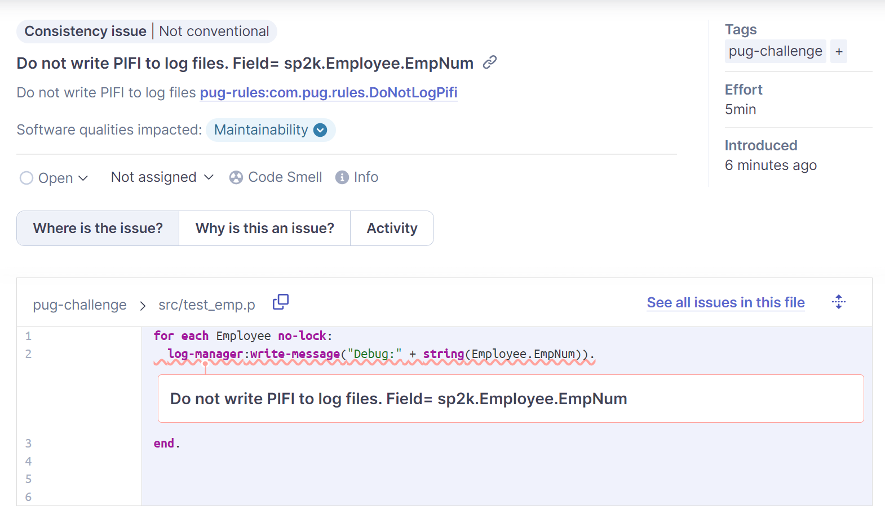

# Ken's Sonar Rules

This repo was created for my presentation(s) at the [PUG Challenge EU](https://pugchallenge.eu/) 2023 conference.  It may not happen quickly, but I intend to maintain this as a small set of examples others can use to help improve their code.  I hope you find it useful.

See the [slide deck (.pptx)](2023-09-20_Custom Sonar Rules and Measures.pptx) for more information.

## Run Unit Tests

```bash
mvn test
```

## Sonar Scan This Project

The following command will run a Sonar scan on this project.  It will use the SonarQube instance running in Docker (as defined in `docker-compose.yml`).  The intention is to tell us about any problems with the java code.

```bash
mvn sonar:sonar -Dsonar.login=admin -Dsonar.password=admin
```

## Deploy to SonarQube Docker Instance

This will build/package the project, download dependencies, and deploy it to the SonarQube instance running in Docker (as defined in `docker-compose.yml`).  It will also restart the image so that the new jar files are loaded.

This should be run before scanning your OE code to ensure the rules are up to date.

```bash
mvn clean install
```

## Screenshot


